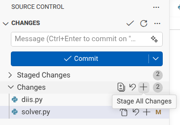
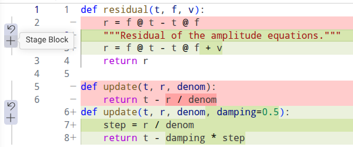
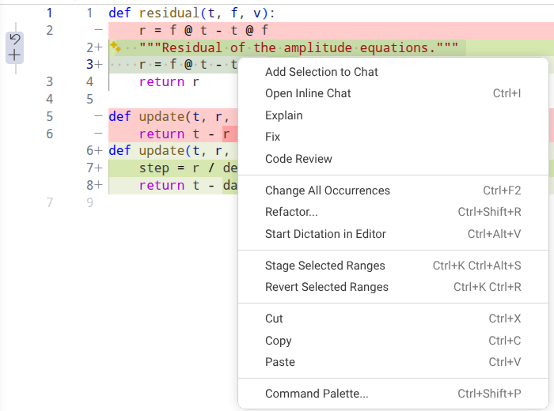
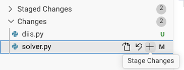
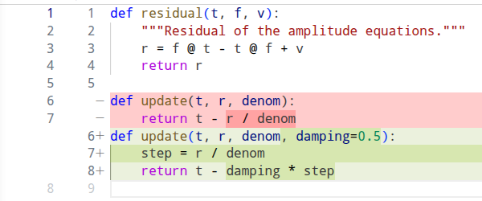

# git review

Review a long run of commits hunk by hunk, in place, using the git index as
the checklist and VS Code's Changes view (or any tool that shows the working
tree against the index) as the UI.

Made for reviewing what a coding agent did over a long session: the agent
keeps committing normally, you review the net result later, accept hunks one
at a time, edit directly while reviewing, and nothing you have accepted comes
back the next time. The agent's commit history is left untouched.

## How it works

`git review start` sets the index of your current checkout to the review base
without touching HEAD or the working tree. The base is `refs/reviewed/<branch>`
if the branch was reviewed before, otherwise the merge-base with `main` or
`master` (or `--base <ref>`). From then on:

- The Changes view shows every net change since the base, hunk by hunk.
- Staging a hunk accepts it (VS Code: Stage Selected Ranges). The index
  persists across sittings, so you can stop and continue tomorrow.
- Your own edits are ordinary working-tree edits. An agent working in the same
  checkout sees them at once.
- The Staged view shows the inverse diff base -> HEAD during a review. Ignore
  it; it is the mirror of the checklist.

Commits are refused while a review is open, by a small guard the tool appends
to the checkout's `pre-commit` hook, because a commit would snapshot the
checklist instead of the code. To commit mid-review, `git review pause`,
commit, `git review resume`; the new commits then show up as pending hunks.

The base is frozen while a review is open. Update main, work on another
branch, come back: the pending hunks are the ones you left. When you do want
the base moved onto an updated main, `git review rebase` rebases the branch
and carries the checklist along (see Scenarios).

`git review done` needs an empty Changes view. It moves
`refs/reviewed/<branch>` to HEAD and, if you edited anything, commits those
edits as one "review edits on <branch>" commit. `git review abort` drops the
checklist and keeps your edits as working-tree changes.

## In VS Code

Open the Source Control view (the branch icon in the activity bar, or
Ctrl+Shift+G). With a review open it shows two groups. Changes is the
checklist: every file with something you have not accepted yet. Staged
Changes is the mirror image of the checklist against HEAD; collapse it and
leave it collapsed. Everything below happens in Changes and in the diff
editor you get by clicking a file there.



Accepting works at three sizes. Hover a hunk in the diff editor and a small
widget appears in the gutter beside it: `+` is Stage Block, which accepts
that hunk, and the curved arrow is Revert Block, which rejects it by putting
the base's text back.



For part of a hunk, select the lines you want and right-click: Stage Selected
Ranges accepts just those lines (Ctrl+K Ctrl+Alt+S), Revert Selected Ranges
rejects them (Ctrl+K Ctrl+R). The rest of the hunk stays pending.



For a whole file, hover its row in Changes and click `+` (Stage Changes); the
curved arrow (Discard Changes) rejects the whole file, including your own
edits in it. The same two icons on the Changes header act on every remaining
file, which is how you end a review whose tail you have already read.



An accepted hunk disappears from the diff; when a file has nothing pending
it leaves Changes. `git review done` when the group is empty.



Editing while you review is just editing: change the text in the diff
editor, save, and the hunk now shows your version. Accept it like any other
hunk. New files the agent added appear with a U; staging one accepts it.
Deleted files appear with a D; staging accepts the deletion.

Moving between hunks: Alt+F5 and Shift+Alt+F5 jump to the next and previous
change in the file, the arrows in the diff editor's title bar do the same,
and the file list is the order across files. The inline diff shown above is
VS Code's default for a narrow editor; the side-by-side view works the same,
with the actions on the right-hand (working tree) side.

## Commands

```
git review start [--base <ref>]   begin: the index becomes the checklist
git review status                 what's pending / accepted (the default)
git review pause                  park the checklist so commits are allowed
git review resume                 bring the checklist back
git review back                   return to the review's branch after a stray checkout
git review rebase [<upstream>]    rebase the branch and carry the checklist along
git review done                   record reviewed/<branch>; commit your edits
git review abort                  drop the checklist (your edits stay as edits)
```

## Install

Put `git-review` somewhere on your `PATH`; git then finds it as `git review`.

```
git clone https://github.com/dnkats/git-review
ln -s "$PWD/git-review/git-review" ~/bin/git-review
```

Bash and git 2.38 or newer (`merge-tree --write-tree`) are the only
requirements. `tests/run.sh` runs the scenarios below on scratch repos.

## Scenarios

**The agent committed on a feature branch in your checkout.** The normal
case. On that branch, `git review start`. The base is the merge-base with
main the first time and `refs/reviewed/<branch>` after that. Accept hunks,
edit, `git review done`.

**The agent worked in a separate worktree.** Review there: `cd` into the
worktree, `git review start`. All state is per worktree, so a review open in
the worktree does not block commits in your main checkout and vice versa.
`refs/reviewed/<branch>` is shared, which is what you want: it is keyed by
branch, not by directory. Don't try to review a branch from a checkout that
doesn't have it checked out; git refuses to check out a branch that another
worktree holds.

**The agent committed directly on main.** `git review start` alone says
"nothing to review", because the merge-base with main is HEAD. Give the base
once: `git review start --base origin/main`, or `--base HEAD~5`, or the
commit you last saw. After `done`, `refs/reviewed/main` exists and the next
`git review start` needs no `--base`.

**The agent left uncommitted changes.** Ask it to commit first; that keeps
its history and gives the review a base. If you review without a commit, the
tool adds nothing: the Changes view already shows the working tree against
HEAD, staging a hunk accepts it, and you commit yourself when Changes is empty.
Committed and uncommitted work together is fine: `git review start` shows
both as pending hunks.

**Several sittings.** Stop whenever. The index persists; `git review status`
tells you where you are. `done` only when Changes is empty. The next review
of the same branch starts at the tree recorded by the last `done`, so
anything already accepted is invisible, even if the agent has since amended
or rebased its commits: the comparison is between trees, not commits.

**The agent needs to keep working while you review.** In the same checkout,
its edits appear among your pending hunks and its commits are refused by the
guard until you `pause`. Better: let it work in another worktree or wait.
If it must commit in this checkout, `git review pause`, commit, `git review
resume`; the new commits show up as pending hunks. Resume on the same branch
you paused on: the parked checklist is keyed by branch and `resume` fails
loudly on any other.

**Rejecting a hunk.** Revert it in the working tree (VS Code: Revert Selected
Ranges, or `git checkout -p`). Now it is your edit, and `done` commits it
with everything else you changed as one "review edits" commit. Reject by
reverting, accept by staging; nothing else empties the Changes view.

**A long review, and main moves on.** Nothing happens to the review: the
base is frozen. `pause` if you need to commit or switch branches, work
elsewhere, update main, come back, `resume`, and the checklist is as you left
it plus whatever the agent committed on the branch meanwhile.

**Moving the base onto the updated main.** `git review rebase` (or `git
review rebase <upstream>`). It parks the checklist, runs `git rebase
--autostash <upstream>`, then carries the checklist onto the new upstream by
a three-way merge of trees: accepted hunks stay accepted, unreviewed hunks
stay pending, and main's changes do not appear at all. If the rebase itself
stops on a conflict, resolve it as usual (`git rebase --continue` or
`--abort`), then `git review resume`; the carry happens there. A file where
main conflicts with a hunk you had accepted keeps its pre-rebase checklist,
so main's changes in that file show up as pending and you look at it once
more; the tool says which files. Merging main into the branch instead of
rebasing: `pause`, merge, `resume` leaves main's hunks pending; use
`git review rebase` if you want them gone, or accept them.

**Rebasing or merging between sittings.** After `done`, rebase or merge as
you like. The next `git review start` notices that the branch now sits on a
newer main and carries the reviewed tree onto it, so only the agent's new
work is pending. Same conflict rule as above.

**Switching branches.** `pause` first. Git often refuses to switch with a
review open, since pending changes would be overwritten. When it doesn't
refuse, you end up on the other branch with the checklist still in the
index, a `post-checkout` guard tells you so, and git then refuses to switch
back. `git review back` repoints HEAD to the review's branch without touching
your files and undoes what the checkout rewrote. Paths the branch never
changed come back clean; pending hunks and your edits were never touched.
The paths the branch did change and the checkout rewrote come back pending,
because whether you had accepted or rejected them cannot be told after the
fact; the command lists them and you accept or reject once more. Every other
command refuses on the wrong branch.

**A branch the agent pushed from elsewhere.** `git fetch`, check the branch
out, `git review start`. Same as the first scenario.

**After the branch is merged.** `refs/reviewed/<branch>` stays behind and is
harmless. `git update-ref -d refs/reviewed/<branch>` removes it.

## Rules for the agent

The agent commits normally during a session; small, frequent commits are
what the review wants. It never commits while a review is open (the guard
enforces this; `pause`, commit, `resume` if it must). At the start of any
task after you reviewed it runs `git review status`, because your review
edits are in the working tree or in the last "review edits" commit, and they
are the truth. It does not run `done` or `abort`; those are yours.

## State

Everything lives inside `.git` and is per worktree: `review-active` (the
marker with the base), `refs/reviewed/<branch>` (where the last review ended),
`refs/review-index/<branch>` (a parked checklist during `pause` and
`rebase`), `review-active.rebase` (a rebase in flight), and the guard blocks in
`hooks/pre-commit` and `hooks/post-checkout`. After a carry the recorded base is a tree, not a commit. Delete those and the tool has never been
there.
